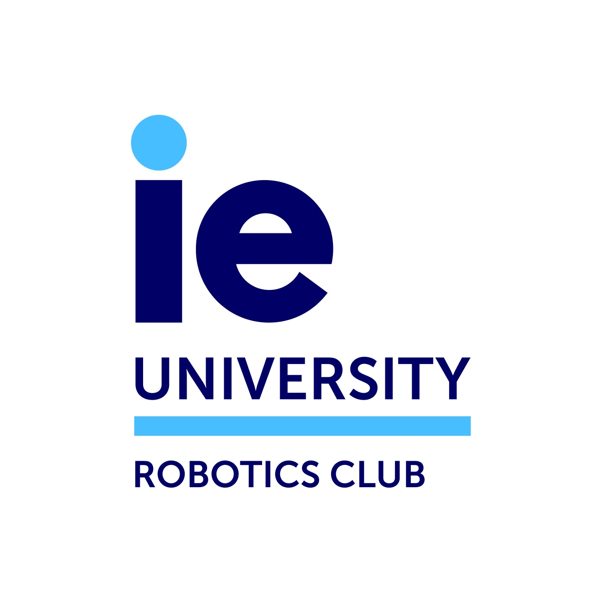

<!--Wave animation CSS Style

-->

<h1 align="center">Hi there, I'm Diego Sanmartin <!--👋--></h1>

  

  &nbsp;
  
  

Motivated student, passionate about Computer Science & Artificial Intelligence.

##  👨🏼‍💻 I’m currently working on

 

 

## 🛠️ Technologies & Tools

<!-- Icons from: https://simpleicons.org/ -->

  
  
  
  
  
  
  
  
  
  
  
  
  
  
  
  
  
  
  

 

# Some Personal Projects

## 🚀 AI/ML

  <table>
    <tr>
      <td>
        
      </td>
      <td>
        
      </td>
    </tr>
  </table>

## 🛠 Full-stack development

  <table>
    <tr>
      <td>
        
      </td>
      <td>
        
      </td>
      <tr>
        <td>
            
        </td>
      </tr>
    </tr>
  </table>

## 👾 Games

  <table>
    <tr>
      <td>
        
      </td>
      <td>
        
      </td>
    </tr>
  </table>

 

## 📈 GitHub Stats
<table>
    <tr>
      <td>
        
      </td>
        <td>
        
      </td>
    </tr>
</table>

 

## 📚 Education

- **Bachelors in Computer Science & Artificial Intelligence** at *IE University* (Expected: May 2024)
- **International Baccaleurette Diploma** at *San Patricio School* (Graduated: 2020)

 

## 🏆 Certifications

- Deep Learning Specialization
- Azure Fundamentals
- Azure AI Fundamentals
- AWS Educate Introduction to Cloud 101